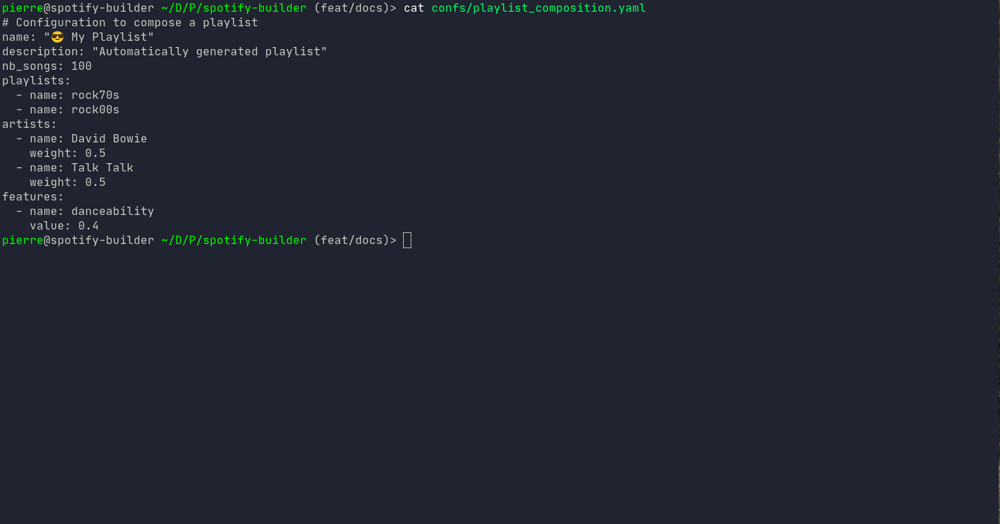

# Spotify Playlist Manager

Welcome to the spotify-builder documentation

### What is spotify-builder

A CLI to describe, compose, upload or classify playlists easily.

New here ? [Get started](./getting_started.md){ .md-button .md-button--primary } Or [follow the guide](guide/composer){ .md-button .md-button}

### What features are available

Three entrypoints come with the spotify-builder repository: 

| Commands   | Description                                            |
|:-----------|:-------------------------------------------------------|
| `compose`  | 🤖 Create a playlist from various sources              |
| `describe` | 📝 Save a playlist' tracks, artists and audio features |
| `queue`    | 🔮 Turn your Spotify queue into a playlist             |

